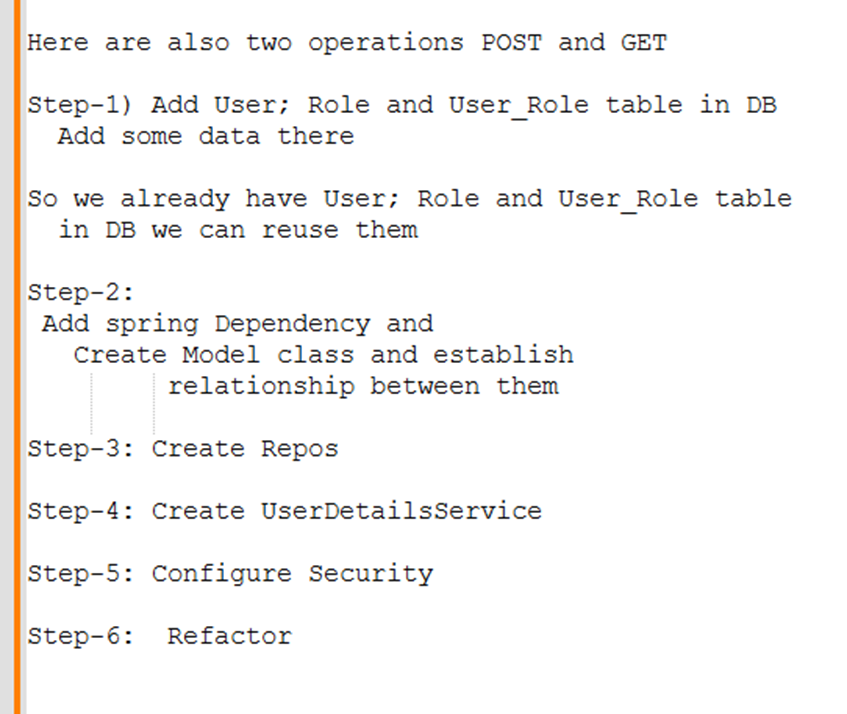
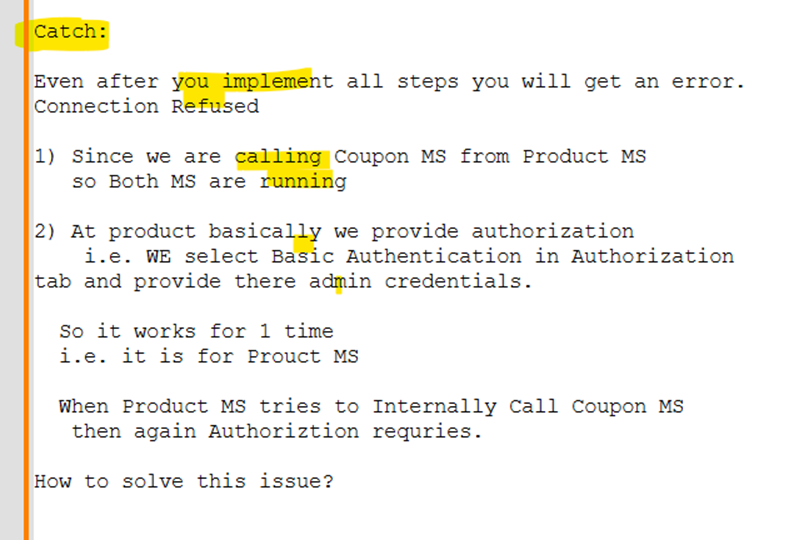
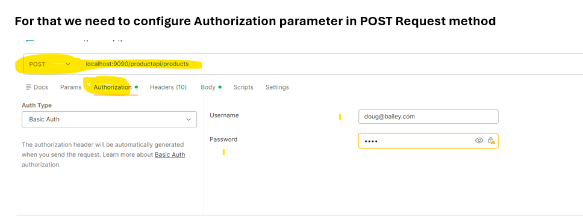
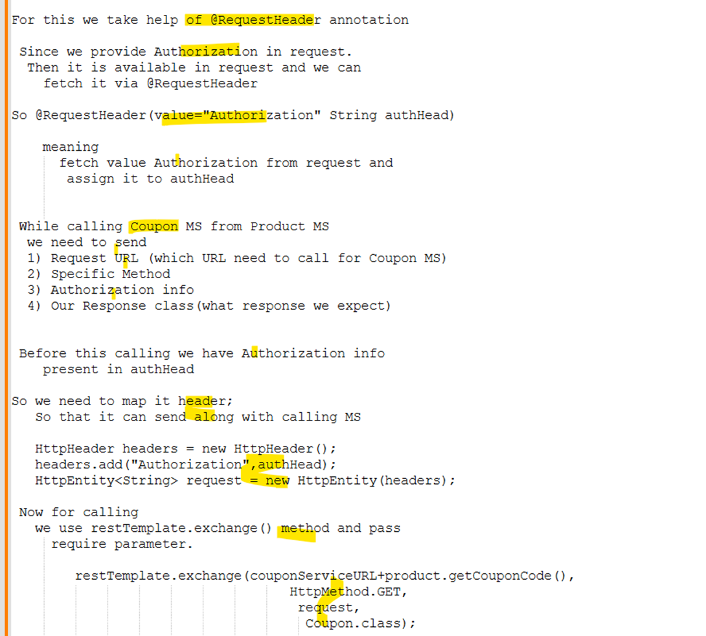
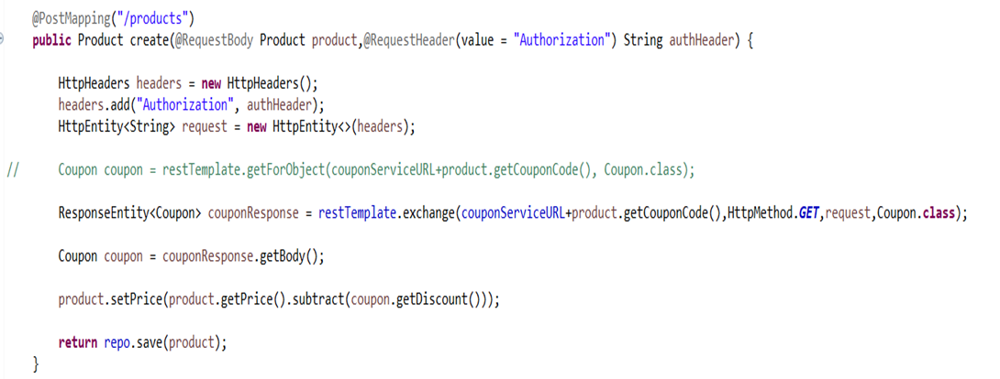
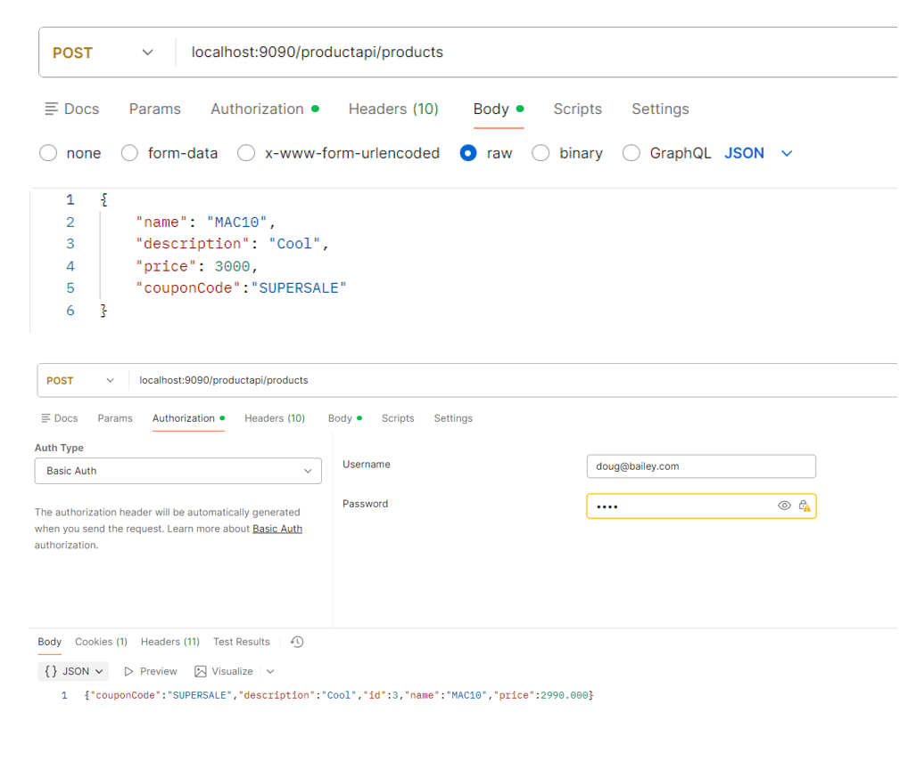

# Assignment: Implements Security for Product MS


### User
```java
package com.bharath.spirngcloud.model;

import java.util.Set;

import jakarta.persistence.Entity;
import jakarta.persistence.FetchType;
import jakarta.persistence.GeneratedValue;
import jakarta.persistence.GenerationType;
import jakarta.persistence.Id;
import jakarta.persistence.JoinColumn;
import jakarta.persistence.JoinTable;
import jakarta.persistence.ManyToMany;

@Entity
public class User {

	@Id
	@GeneratedValue(strategy = GenerationType.IDENTITY)
	private Long id;
	private String firstName;
	private String lastName;
	private String email;
	private String password;
	
	@ManyToMany(fetch = FetchType.EAGER)
	@JoinTable(name = "user_role",joinColumns = @JoinColumn(name="user_id"),
	      inverseJoinColumns = @JoinColumn(name="role_id"))
	private Set<Role> roles;

	
	public Long getId() {
		return id;
	}

	public void setId(Long id) {
		this.id = id;
	}

	public String getFirstName() {
		return firstName;
	}

	public void setFirstName(String firstName) {
		this.firstName = firstName;
	}

	public String getLastName() {
		return lastName;
	}

	public void setLastName(String lastName) {
		this.lastName = lastName;
	}

	public String getEmail() {
		return email;
	}

	public void setEmail(String email) {
		this.email = email;
	}

	public String getPassword() {
		return password;
	}

	public void setPassword(String password) {
		this.password = password;
	}

	public Set<Role> getRoles() {
		return roles;
	}

	public void setRoles(Set<Role> roles) {
		this.roles = roles;
	}

}
```
### Role
```java
package com.bharath.spirngcloud.security;

import org.springframework.context.annotation.Bean;
import org.springframework.context.annotation.Configuration;
import org.springframework.http.HttpMethod;
import org.springframework.security.config.Customizer;
import org.springframework.security.config.annotation.web.builders.HttpSecurity;
import org.springframework.security.crypto.bcrypt.BCryptPasswordEncoder;
import org.springframework.security.web.SecurityFilterChain;

@Configuration
public class CustomSecurityConfig {
	
	@Bean
	BCryptPasswordEncoder encode() {
		return new BCryptPasswordEncoder();
	}
	
	@Bean
	SecurityFilterChain filterChain(HttpSecurity httpSecurity) {
		
		httpSecurity.httpBasic(Customizer.withDefaults());
		
		httpSecurity.authorizeHttpRequests(auth ->
		auth.requestMatchers(HttpMethod.GET,"/productapi/products/{pid: ^[A-Z]*$}").hasAnyRole("ADMIN","USER")
		.requestMatchers(HttpMethod.POST,"/productapi/products").hasRole("ADMIN"));
		
		httpSecurity.csrf(csrf ->csrf.disable());
		
		return httpSecurity.build();
	}

}
```
### ProductRepo
```java
package com.bharath.spirngcloud.repos;

import org.springframework.data.jpa.repository.JpaRepository;

import com.bharath.spirngcloud.model.Product;


public interface ProductRepo extends JpaRepository<Product, Long> {

	
}
```
### RoleRepo
```java
package com.bharath.spirngcloud.repos;

import org.springframework.data.jpa.repository.JpaRepository;

import com.bharath.spirngcloud.model.Role;

public interface RoleRepo extends JpaRepository<Role, Long> {

}
```
### CustomUserDetailsService
```java
package com.bharath.spirngcloud.service;

import org.springframework.beans.factory.annotation.Autowired;
import org.springframework.security.core.userdetails.UserDetails;
import org.springframework.security.core.userdetails.UserDetailsService;
import org.springframework.security.core.userdetails.UsernameNotFoundException;
import org.springframework.stereotype.Service;

import com.bharath.spirngcloud.model.User;
import com.bharath.spirngcloud.repos.UserRepo;

@Service
public class CustomUserDetailsService implements UserDetailsService {
	
	@Autowired
	private UserRepo repo;

	@Override
	public UserDetails loadUserByUsername(String username) throws UsernameNotFoundException {
		
		User user1 = repo.findByEmail(username);
		
		if(user1==null) {
			throw new UsernameNotFoundException(username);
		}
		
		return new org.springframework.security.core.userdetails.User(user1.getEmail(), user1.getPassword(), user1.getRoles());
	}

}
```
### CustomSecurityConfig
```java
package com.bharath.spirngcloud.security;

import org.springframework.context.annotation.Bean;
import org.springframework.context.annotation.Configuration;
import org.springframework.http.HttpMethod;
import org.springframework.security.config.Customizer;
import org.springframework.security.config.annotation.web.builders.HttpSecurity;
import org.springframework.security.crypto.bcrypt.BCryptPasswordEncoder;
import org.springframework.security.web.SecurityFilterChain;

@Configuration
public class CustomSecurityConfig {
	
	@Bean
	BCryptPasswordEncoder encode() {
		return new BCryptPasswordEncoder();
	}
	
	@Bean
	SecurityFilterChain filterChain(HttpSecurity httpSecurity) {
		
		httpSecurity.httpBasic(Customizer.withDefaults());
		
		httpSecurity.authorizeHttpRequests(auth ->
		auth.requestMatchers(HttpMethod.GET,"/productapi/products/{pid: ^[A-Z]*$}").hasAnyRole("ADMIN","USER")
		.requestMatchers(HttpMethod.POST,"/productapi/products").hasRole("ADMIN"));
		
		httpSecurity.csrf(csrf ->csrf.disable());
		
		return httpSecurity.build();
	}

}
```
### ProductRestController
```java
package com.bharath.spirngcloud.controller;

import java.util.Optional;

import org.springframework.beans.factory.annotation.Autowired;
import org.springframework.beans.factory.annotation.Value;
import org.springframework.http.HttpEntity;
import org.springframework.http.HttpHeaders;
import org.springframework.http.HttpMethod;
import org.springframework.http.ResponseEntity;
import org.springframework.web.bind.annotation.GetMapping;
import org.springframework.web.bind.annotation.PathVariable;
import org.springframework.web.bind.annotation.PostMapping;
import org.springframework.web.bind.annotation.RequestBody;
import org.springframework.web.bind.annotation.RequestHeader;
import org.springframework.web.bind.annotation.RequestMapping;
import org.springframework.web.bind.annotation.RestController;
import org.springframework.web.client.RestTemplate;

import com.bharath.spirngcloud.dto.Coupon;
import com.bharath.spirngcloud.model.Product;
import com.bharath.spirngcloud.repos.ProductRepo;

@RestController
@RequestMapping("/productapi")
public class ProductRestController {
	
	@Autowired
	ProductRepo repo;
	
	@Autowired
	private RestTemplate restTemplate;
	
	@Value("${couponService.url}")
	private String couponServiceURL;
	
	
	@PostMapping("/products")
	public Product create(@RequestBody Product product,@RequestHeader(value = "Authorization") String authHeader) {
		
		HttpHeaders headers = new HttpHeaders();
		headers.add("Authorization", authHeader);
		HttpEntity<String> request = new HttpEntity<>(headers);
		
//		Coupon coupon = restTemplate.getForObject(couponServiceURL+product.getCouponCode(), Coupon.class);
		
		ResponseEntity<Coupon> couponResponse = restTemplate.exchange(couponServiceURL+product.getCouponCode(),HttpMethod.GET,request,Coupon.class);		
		
		Coupon coupon = couponResponse.getBody();
		
		product.setPrice(product.getPrice().subtract(coupon.getDiscount()));
		
		return repo.save(product);
	}
	
	@GetMapping("/products/{pid}")
	public Product getProduct(@PathVariable("pid") Long pid) {
		
		Optional<Product> product = repo.findById(pid);
		
		return product.get();
	}

}
```