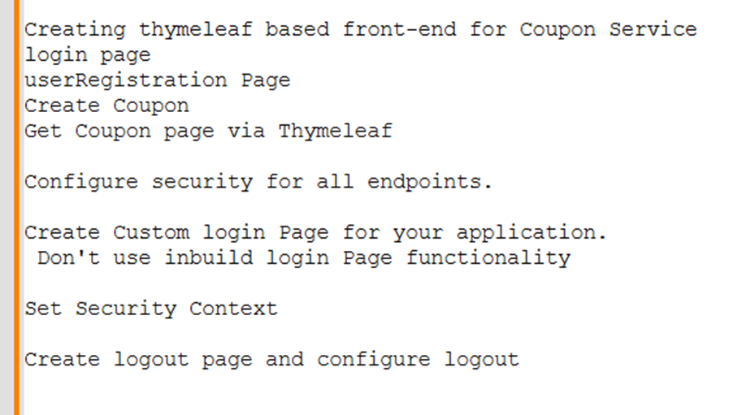
### Adding a thymmleaf dependency in pom.xml
```xml
	<dependency>
			<groupId>org.springframework.boot</groupId>
			<artifactId>spring-boot-starter-thymeleaf</artifactId>
	</dependency>
```
###  Setup a Web Application
#### Right Click - -> Properties - -> Java Build Path - -> Source - -> Add folder - -> src/main/resources  - -> select template 
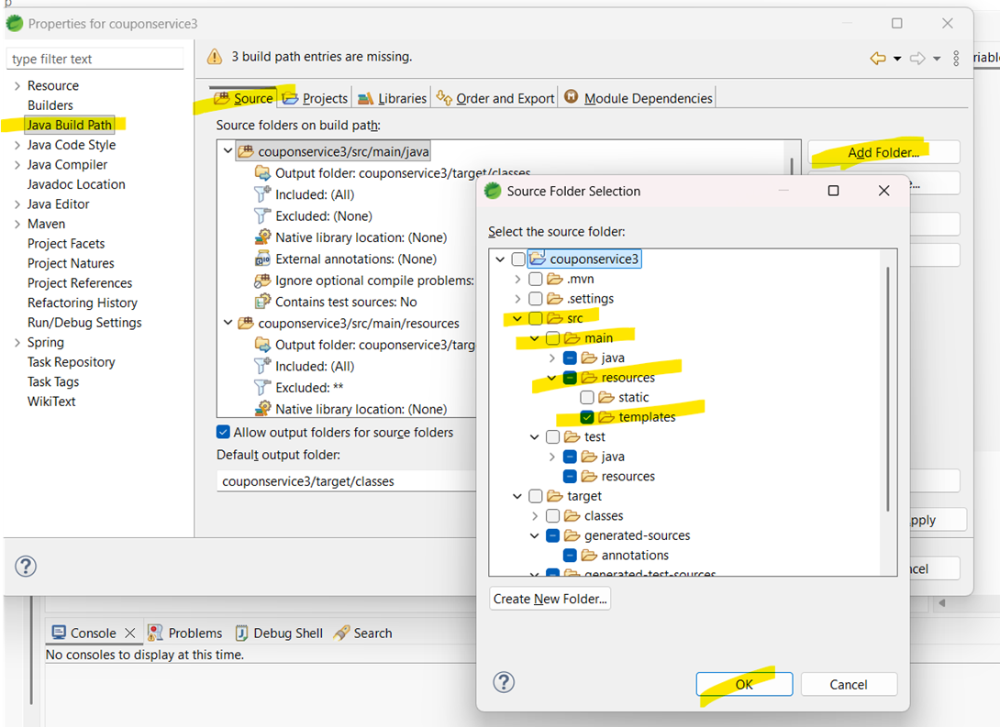
### Add your downloaded HTML files here in templates
#### When user access / that is absolute URL land on index.html
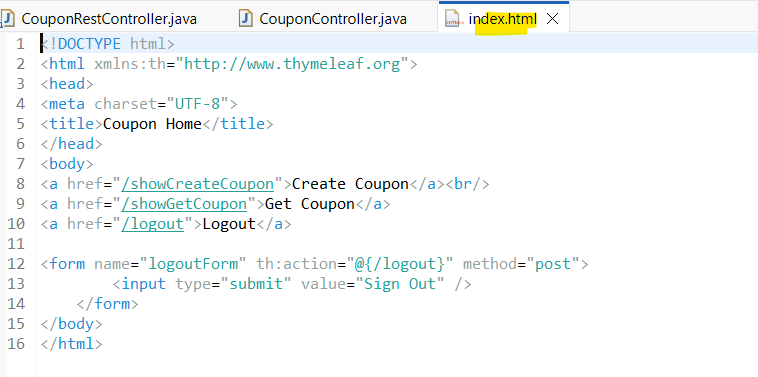
#### see mapping at controller
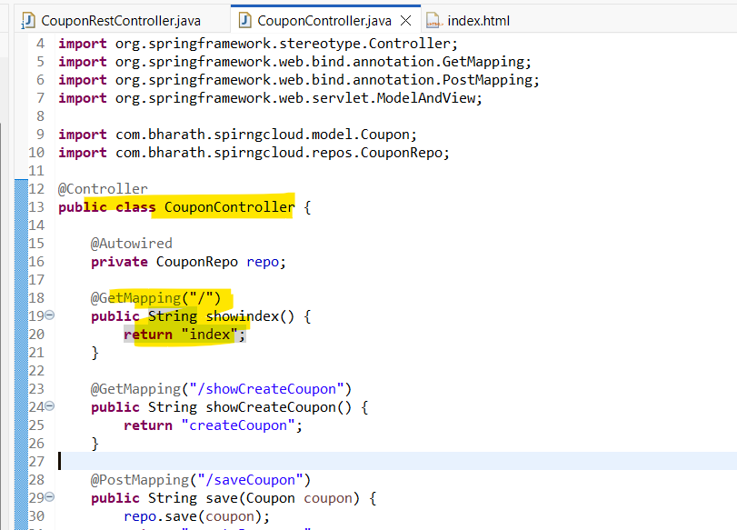
### HTML files
### index.html
```html
<!DOCTYPE html>
<html xmlns:th="http://www.thymeleaf.org">

<head>
	<meta charset="UTF-8">
	<title>Coupon Home</title>
</head>

<body>
	<a href="/showCreateCoupon">Create Coupon</a><br />
	<a href="/showGetCoupon">Get Coupon</a>
	<a href="/logout">Logout</a>

	<form name="logoutForm" th:action="@{/logout}" method="post">
		<input type="submit" value="Sign Out" />
	</form>
</body>

</html>
```
### createCoupon.html
```html
<!DOCTYPE html>
<html xmlns:th="http://www.thymeleaf.org">

<head>
	<meta charset="UTF-8">
	<title>Create Coupon</title>
</head>

<body>
	<h2>Create Coupon</h2>
	<form action="#" th:action="@{/saveCoupon}" method="post">

		Code:<input name="code" />
		Discount:<input name="discount" />
		Expiry Date:<input name="expDate" />
		<input type="submit" value="Save" />
	</form>

</body>

</html>
```
### getCoupon.html
```html
<!DOCTYPE html>
<html>

<head>
	<meta charset="UTF-8">
	<title>Get Coupon</title>
</head>

<body>
	<form action="/getCoupon" method="post">
		Coupon Code<input name="code">
		<input type="submit" value="Get Coupon" />
	</form>

</body>

</html>
```
### couponDetails.html
```html
<!DOCTYPE html>

<head>
	<meta charset="UTF-8">
	<title>Coupon Details</title>
</head>

<body>
	<h2>Coupon Details</h2>
	Code:<b th:text="${coupon.code}"></b><br />
	Discount:<b th:text="${coupon.discount}"></b><br />
	Expiry Date:<b th:text="${coupon.expDate}"></b><br />
</body>

</html>
```
### createResponse.html
```html
<!DOCTYPE html>
<html>

<head>
	<meta charset="UTF-8">
	<title>Create Response</title>
</head>

<body>
	<b>Coupon got created successfully!!</b>
</body>

</html>
```
### CouponController.java
```java
package com.bharath.spirngcloud.controller;

import org.springframework.beans.factory.annotation.Autowired;
import org.springframework.stereotype.Controller;
import org.springframework.web.bind.annotation.GetMapping;
import org.springframework.web.bind.annotation.PostMapping;
import org.springframework.web.servlet.ModelAndView;

import com.bharath.spirngcloud.model.Coupon;
import com.bharath.spirngcloud.repos.CouponRepo;

@Controller
public class CouponController {

	@Autowired
	private CouponRepo repo;

	@GetMapping("/")
	public String showindex() {
		return "index";
	}

	@GetMapping("/showCreateCoupon")
	public String showCreateCoupon() {
		return "createCoupon";
	}

	@PostMapping("/saveCoupon")
	public String save(Coupon coupon) {
		repo.save(coupon);
		return "createResponse";
	}

	@GetMapping("/showGetCoupon")
	public String showGetCoupon() {
		return "getCoupon";
	}

	@PostMapping("/getCoupon")
	public ModelAndView getCoupon(String code) {
		ModelAndView mav = new ModelAndView("couponDetails");
		System.out.println(code);
		mav.addObject(repo.findByCode(code));
		return mav;
	}

}
```
### Providing access to our WEB Application
####  ****Current Scenario – when we hit= => localhost:9091/***
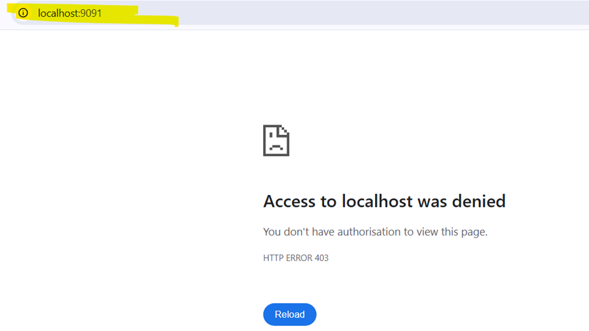
### Nee to configure security for your absolute URL.
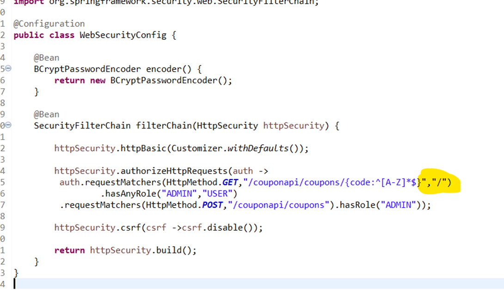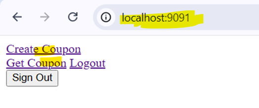
### Change to form login since its web app
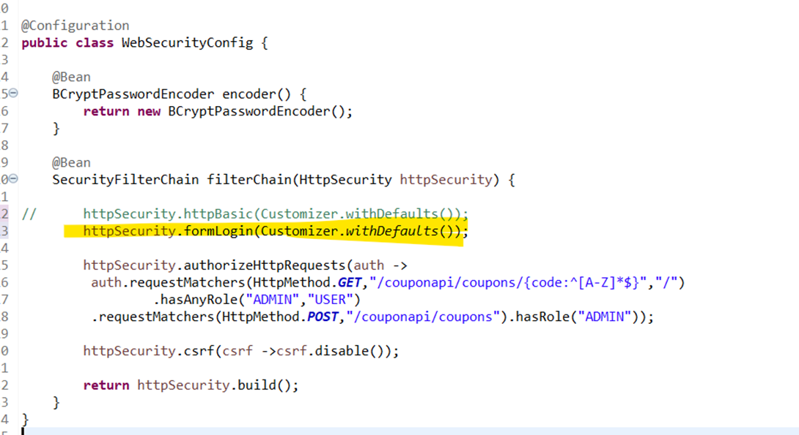
### Providing access to other URL.
## Remember
### Only ADMIN Role user can perform POST (Create Coupon) and GET (Fetch Coupon) operation. 
### Other USER Role user can perform only GET (Fetch Coupon) operation.
### WebSecurityConfig.java
```java
package com.bharath.spirngcloud.security;

import org.springframework.context.annotation.Bean;
import org.springframework.context.annotation.Configuration;
import org.springframework.http.HttpMethod;
import org.springframework.security.config.Customizer;
import org.springframework.security.config.annotation.web.builders.HttpSecurity;
import org.springframework.security.crypto.bcrypt.BCryptPasswordEncoder;
import org.springframework.security.web.SecurityFilterChain;

@Configuration
public class WebSecurityConfig {
	
	@Bean
	BCryptPasswordEncoder encoder() {
		return new BCryptPasswordEncoder();
	}

	@Bean
	SecurityFilterChain filterChain(HttpSecurity httpSecurity) {

		httpSecurity.formLogin(Customizer.withDefaults());
		
		httpSecurity.authorizeHttpRequests(auth ->auth
		 .requestMatchers(HttpMethod.GET,"/couponapi/coupons/{code:^[A-Z]*$}","/","/showGetCoupon","/getCoupon")
		                       .hasAnyRole("ADMIN","USER")
		  .requestMatchers(HttpMethod.POST,"/getCoupon")
		                       .hasAnyRole("ADMIN","USER")
		 .requestMatchers(HttpMethod.GET,"/showCreateCoupon","/createCoupon","/createResponse")
		                      .hasRole("ADMIN")    
		 .requestMatchers(HttpMethod.POST,"/couponapi/coupons","/saveCoupon")
		                     .hasRole("ADMIN"));
		
		httpSecurity.csrf(csrf ->csrf.disable());
		
		return httpSecurity.build();
	}
}
```
### Test: Login via ADMIN Role user 
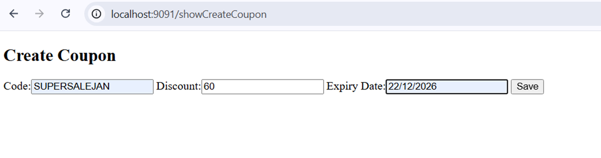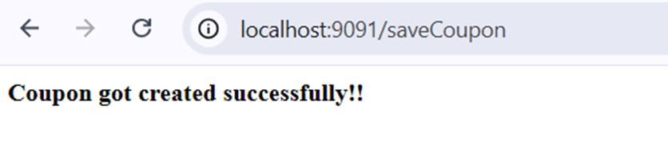
### Test: Login via USER role user john
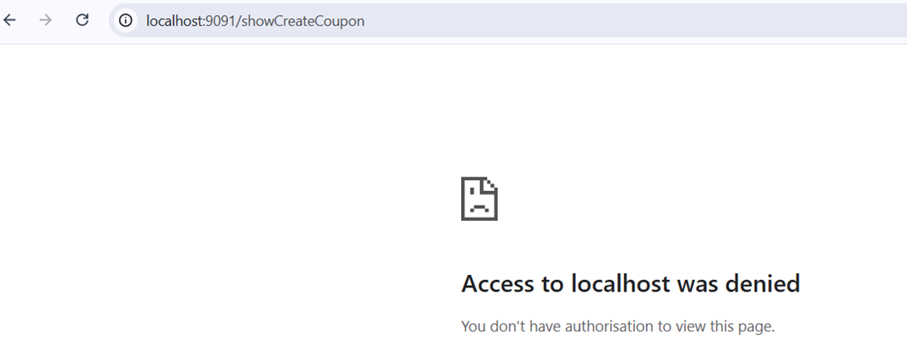
### Login via ADMIN/USER Role users GET operations can be accessible by both.
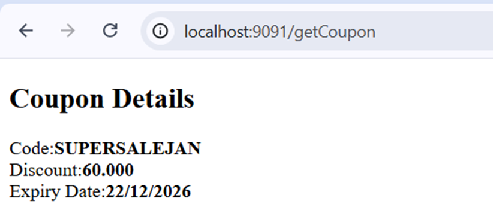


