# Section-5 Secure REST API
# 41) Steps
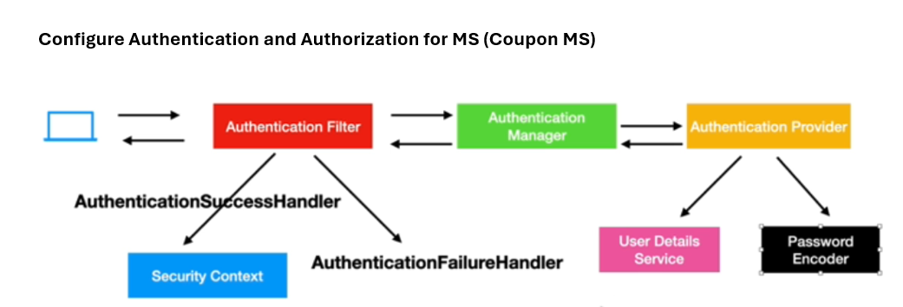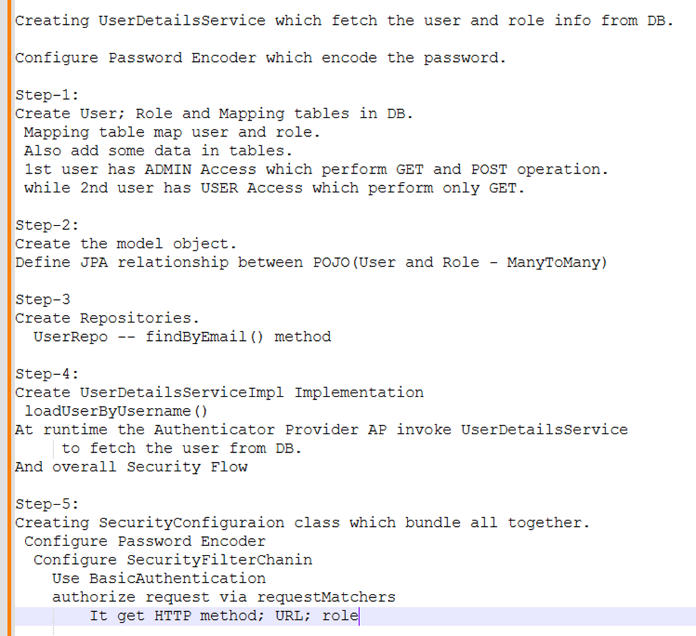
# 42) Create Tables
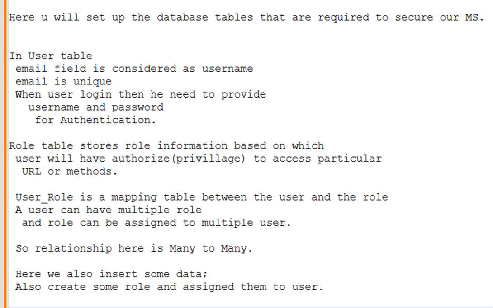
```sql
use mydb;

CREATE TABLE USER 
(
ID INT NOT NULL AUTO_INCREMENT,
FIRST_NAME VARCHAR(20),
LAST_NAME VARCHAR(20),
EMAIL VARCHAR(20),
PASSWORD VARCHAR(256), 
PRIMARY KEY (ID),
UNIQUE KEY (EMAIL)
);

CREATE TABLE ROLE 
(
ID INT NOT NULL AUTO_INCREMENT,
NAME VARCHAR(20),
PRIMARY KEY (ID)
);

CREATE TABLE USER_ROLE(
USER_ID int,
ROLE_ID int,
FOREIGN KEY (user_id)
REFERENCES user(id),
FOREIGN KEY (role_id)
REFERENCES role(id)
);

insert into user(first_name,last_name,email,password) values ('doug','bailey','doug@bailey.com','$2a$10$U2STWqktwFbvPPsfblVeIuy11vQ1S/0LYLeXQf1ZL0cMXc9HuTEA2');
insert into user(first_name,last_name,email,password) values ('john','ferguson','john@ferguson.com','$2a$10$YzcbPL.fnzbWndjEcRkDmO1E4vOvyVYP5kLsJvtZnR1f8nlXjvq/G');

insert into role values(1,'ROLE_ADMIN');
insert into role values(2,'ROLE_USER');

insert into user_role values(1,1);
insert into user_role values(2,2);

select * from user;
select * from role;
select * from user_role;
```
# 43) Create Entities

### User
```java
package com.bharath.spirngcloud.model;

import jakarta.persistence.Entity;
import jakarta.persistence.GeneratedValue;
import jakarta.persistence.GenerationType;
import jakarta.persistence.Id;

@Entity
public class User {

	@Id
	@GeneratedValue(strategy = GenerationType.IDENTITY)
	private Long id;

	private String firstName;
	private String lastName;
	private String email;
	private String password;

	public Long getId() {
		return id;
	}

	public void setId(Long id) {
		this.id = id;
	}

	public String getFirstName() {
		return firstName;
	}

	public void setFirstName(String firstName) {
		this.firstName = firstName;
	}

	public String getLastName() {
		return lastName;
	}

	public void setLastName(String lastName) {
		this.lastName = lastName;
	}

	public String getEmail() {
		return email;
	}

	public void setEmail(String email) {
		this.email = email;
	}

	public String getPassword() {
		return password;
	}

	public void setPassword(String password) {
		this.password = password;
	}

}
```
### Role
```java
package com.bharath.spirngcloud.model;

import org.jspecify.annotations.Nullable;
import org.springframework.security.core.GrantedAuthority;

import jakarta.persistence.Entity;
import jakarta.persistence.GeneratedValue;
import jakarta.persistence.GenerationType;
import jakarta.persistence.Id;

@Entity
public class Role implements GrantedAuthority {
	
	/* getAuthority() method is invoked internally by spring security to get the
       role of a particular user and 
    the getAuthority() method should return the name of the role.
    Since authority internally is nothing but the role */

	@Id
	@GeneratedValue(strategy = GenerationType.IDENTITY)
	private Long id;

	private String name; // Its a roleName

	@Override
	public @Nullable String getAuthority() {

		return name;
	}

	public Long getId() {
		return id;
	}

	public void setId(Long id) {
		this.id = id;
	}

	public String getName() {
		return name;
	}

	public void setName(String name) {
		this.name = name;
	}

}
```
# 44) Define Entity Relationship
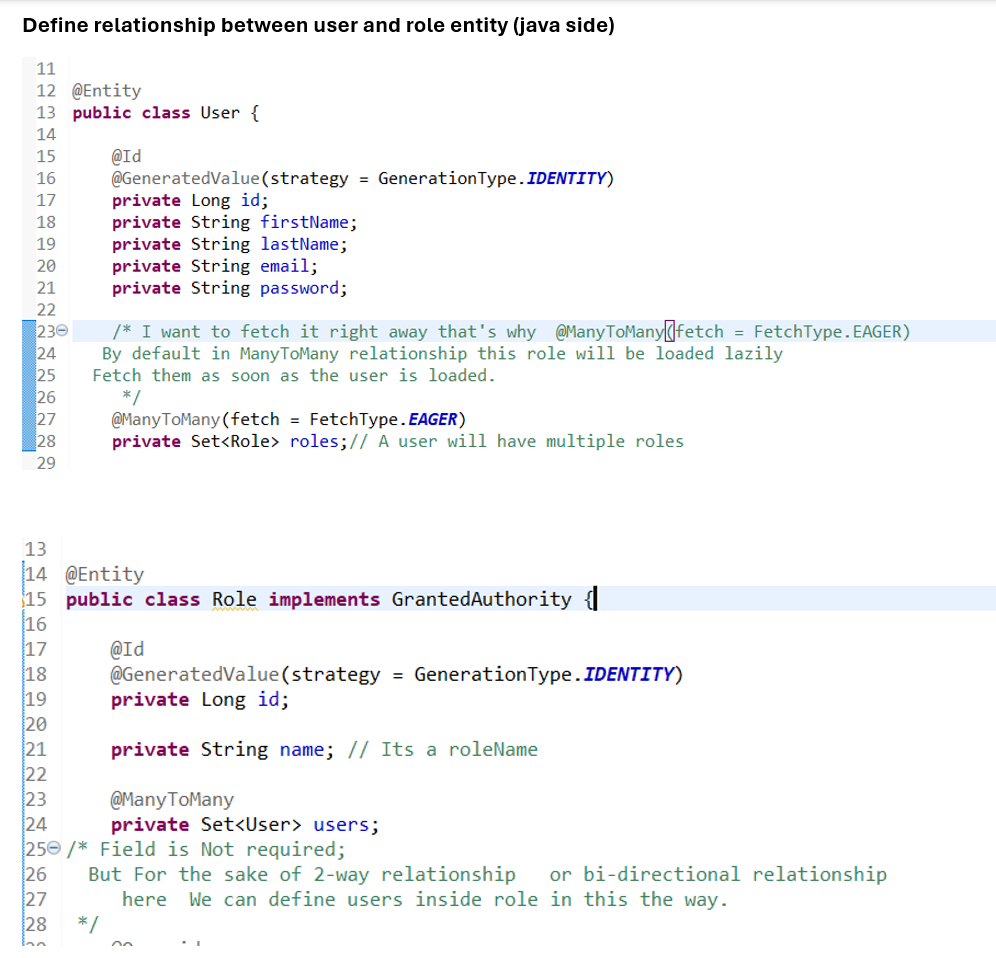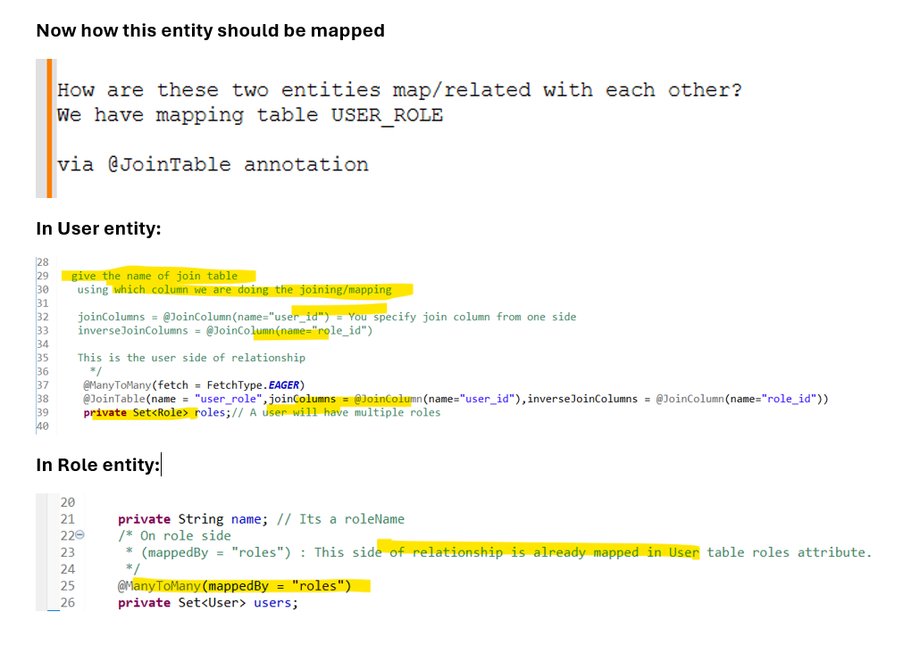
### User
```java
package com.bharath.spirngcloud.model;

import java.util.Set;

import jakarta.persistence.Entity;
import jakarta.persistence.FetchType;
import jakarta.persistence.GeneratedValue;
import jakarta.persistence.GenerationType;
import jakarta.persistence.Id;
import jakarta.persistence.JoinColumn;
import jakarta.persistence.JoinTable;
import jakarta.persistence.ManyToMany;

@Entity
public class User {
	
	@Id
	@GeneratedValue(strategy = GenerationType.IDENTITY)
	private Long id;
	private String firstName;
	private String lastName;
	private String email;
	private String password;
	
	/* I want to fetch it right away that's why  @ManyToMany(fetch = FetchType.EAGER)
   By default in ManyToMany relationship this role will be loaded lazily 
  Fetch them as soon as the user is loaded.
  
  give the name of join table
   using which column we are doing the joining/mapping
   
   joinColumns = @JoinColumn(name="user_id") = You specify join column from one side
   inverseJoinColumns = @JoinColumn(name="role_id")
   
   This is the user side of relationship
	 */
	@ManyToMany(fetch = FetchType.EAGER)
	@JoinTable(name = "user_role",joinColumns = @JoinColumn(name="user_id"),inverseJoinColumns = @JoinColumn(name="role_id"))
	private Set<Role> roles;// A user will have multiple roles

	public Set<Role> getRoles() {
		return roles;
	}

	public void setRoles(Set<Role> roles) {
		this.roles = roles;
	}
	
	public Long getId() {
		return id;
	}

	public void setId(Long id) {
		this.id = id;
	}

	public String getFirstName() {
		return firstName;
	}

	public void setFirstName(String firstName) {
		this.firstName = firstName;
	}

	public String getLastName() {
		return lastName;
	}

	public void setLastName(String lastName) {
		this.lastName = lastName;
	}

	public String getEmail() {
		return email;
	}

	public void setEmail(String email) {
		this.email = email;
	}

	public String getPassword() {
		return password;
	}

	public void setPassword(String password) {
		this.password = password;
	}

}
```
### Role
```java
package com.bharath.spirngcloud.model;

import java.util.Set;

import org.jspecify.annotations.Nullable;
import org.springframework.security.core.GrantedAuthority;

import jakarta.persistence.Entity;
import jakarta.persistence.GeneratedValue;
import jakarta.persistence.GenerationType;
import jakarta.persistence.Id;
import jakarta.persistence.ManyToMany;

@Entity
public class Role implements GrantedAuthority {

	@Id
	@GeneratedValue(strategy = GenerationType.IDENTITY)
	private Long id;

	private String name; // Its a roleName
	/* On role side 
	 * (mappedBy = "roles") : This side of relationship is already mapped in User table roles attribute.
	 */
	@ManyToMany(mappedBy = "roles")
	private Set<User> users; 
/* Field is Not required;
  But For the sake of 2-way relationship   or bi-directional relationship
     here  We can define users inside role in this the way. 
 */
	@Override
	public @Nullable String getAuthority() {

		return name;
	}

	public Long getId() {
		return id;
	}

	public void setId(Long id) {
		this.id = id;
	}

	public String getName() {
		return name;
	}

	public void setName(String name) {
		this.name = name;
	}

	public Set<User> getUsers() {
		return users;
	}

	public void setUsers(Set<User> users) {
		this.users = users;
	}

}
```
# 45) Create Repos
### User Repo
```java
package com.bharath.spirngcloud.repos;

import org.springframework.data.jpa.repository.JpaRepository;

import com.bharath.spirngcloud.model.User;


public interface UserRepo extends JpaRepository<User, Long>{

	//Retrieve user details by simply providing email
	User findByEmail(String email);
}
```
### Role Repo
```java
package com.bharath.spirngcloud.repos;

import org.springframework.data.jpa.repository.JpaRepository;

import com.bharath.spirngcloud.model.Role;

public interface RoleRepo extends JpaRepository<Role, Long> {

}
```
# 46) Implement UserDetailsService
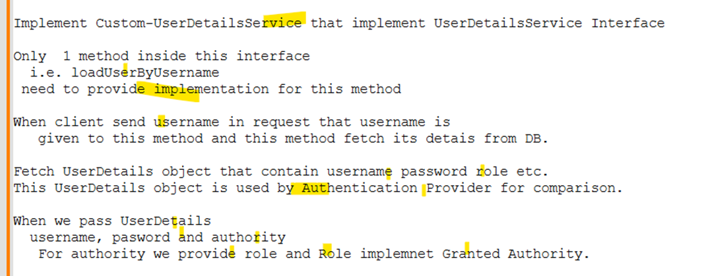
### UserDetailsServiceImpl
```java
package com.bharath.spirngcloud.security;

import org.springframework.beans.factory.annotation.Autowired;
import org.springframework.security.core.userdetails.UserDetails;
import org.springframework.security.core.userdetails.UserDetailsService;
import org.springframework.security.core.userdetails.UsernameNotFoundException;
import org.springframework.stereotype.Service;

import com.bharath.spirngcloud.model.User;
import com.bharath.spirngcloud.repos.UserRepo;

@Service
public class UserDetailsServiceImpl implements UserDetailsService {

	@Autowired
	UserRepo repo; //via userName fetch details use repo

	@Override
	public UserDetails loadUserByUsername(String username) throws UsernameNotFoundException {

		User user = repo.findByEmail(username); //This user come from DB
		
		if(user == null) {
			throw new UsernameNotFoundException("User not found for email: "+username);
		}
		
		//But we need to return UserDetails.		
		//Spring Security gives user object
		return new org.springframework.security.core.userdetails.User(user.getEmail(), user.getPassword(), user.getRoles());
	}

}
```
### Flow
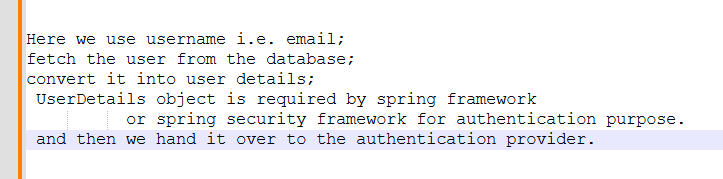
# 47) Configure Security
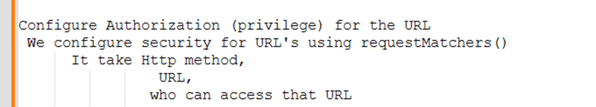
### SecurityConfig
```java
package com.bharath.spirngcloud.security;

import org.springframework.context.annotation.Bean;
import org.springframework.context.annotation.Configuration;
import org.springframework.http.HttpMethod;
import org.springframework.security.config.Customizer;
import org.springframework.security.config.annotation.web.builders.HttpSecurity;
import org.springframework.security.crypto.bcrypt.BCryptPasswordEncoder;
import org.springframework.security.web.SecurityFilterChain;

@Configuration
public class SecurityConfig {

	//1.Password Encoder Bean
	@Bean
	BCryptPasswordEncoder encoder() {
		return new BCryptPasswordEncoder();
	}
	
	//2. SecurityFilterChain Bean
	@Bean
	SecurityFilterChain filterChain(HttpSecurity httpSecurity) {
		
		httpSecurity.httpBasic(Customizer.withDefaults()); //Use Basic Auth
		
		/*Configure Authorization (privilege) for the URL
	We configure security for URL's using requestMatchers()
	  It take Http method, URL, who can access that URL	 	 
		 */
		 
		httpSecurity.authorizeHttpRequests(auth -> auth.requestMatchers(HttpMethod.GET,"/couponapi/coupons/**")
				.hasAnyRole("USER","ADMIN")
				.requestMatchers(HttpMethod.POST,"/couponapi/coupons").hasRole("ADMIN"));		
		//Any user with this role can hit this endpoint.		
		
		
		// also disable csrf
		// Our is REST App not WEB app; So not require CSRF
		httpSecurity.csrf(csrf -> csrf.disable());
		
		return httpSecurity.build();
	}
}
```
# 48) Test
### GET
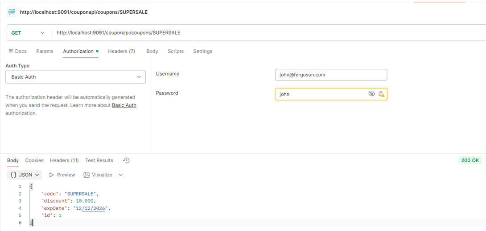
### If you use another id that doesn’t exist
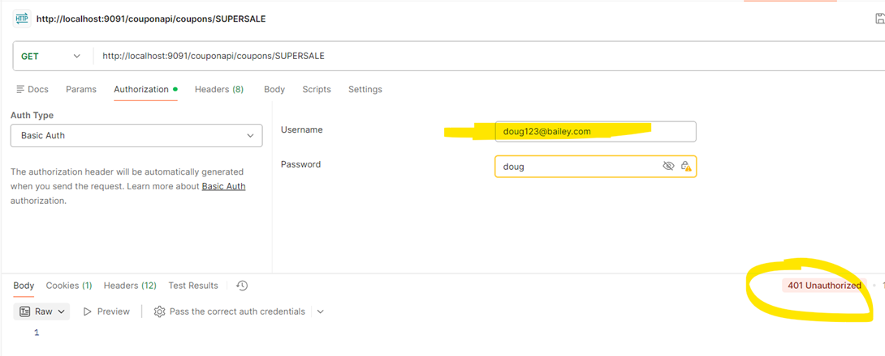
### POST
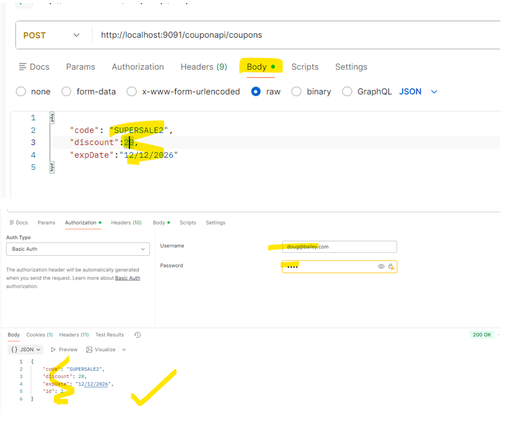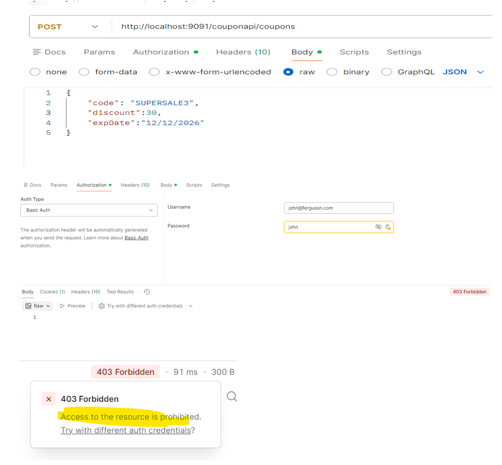
# 49) Use Regular Expression
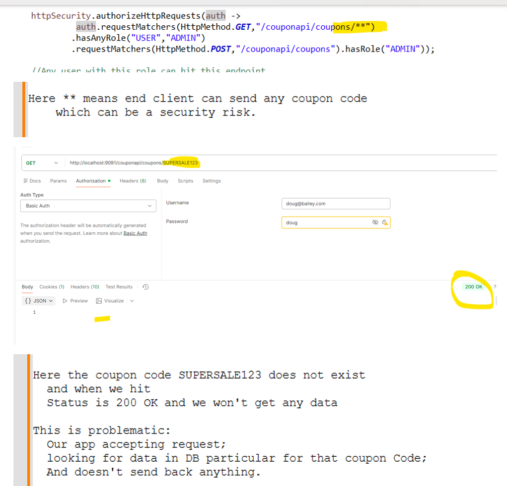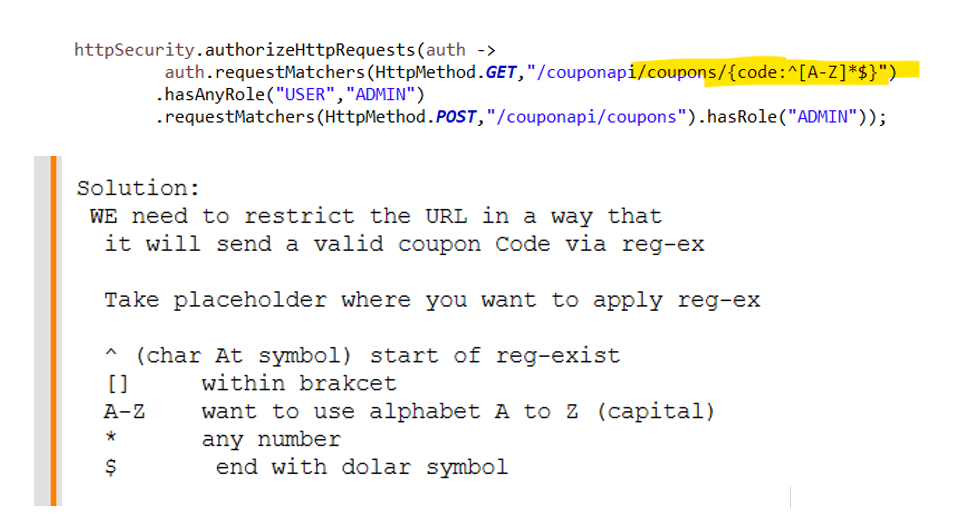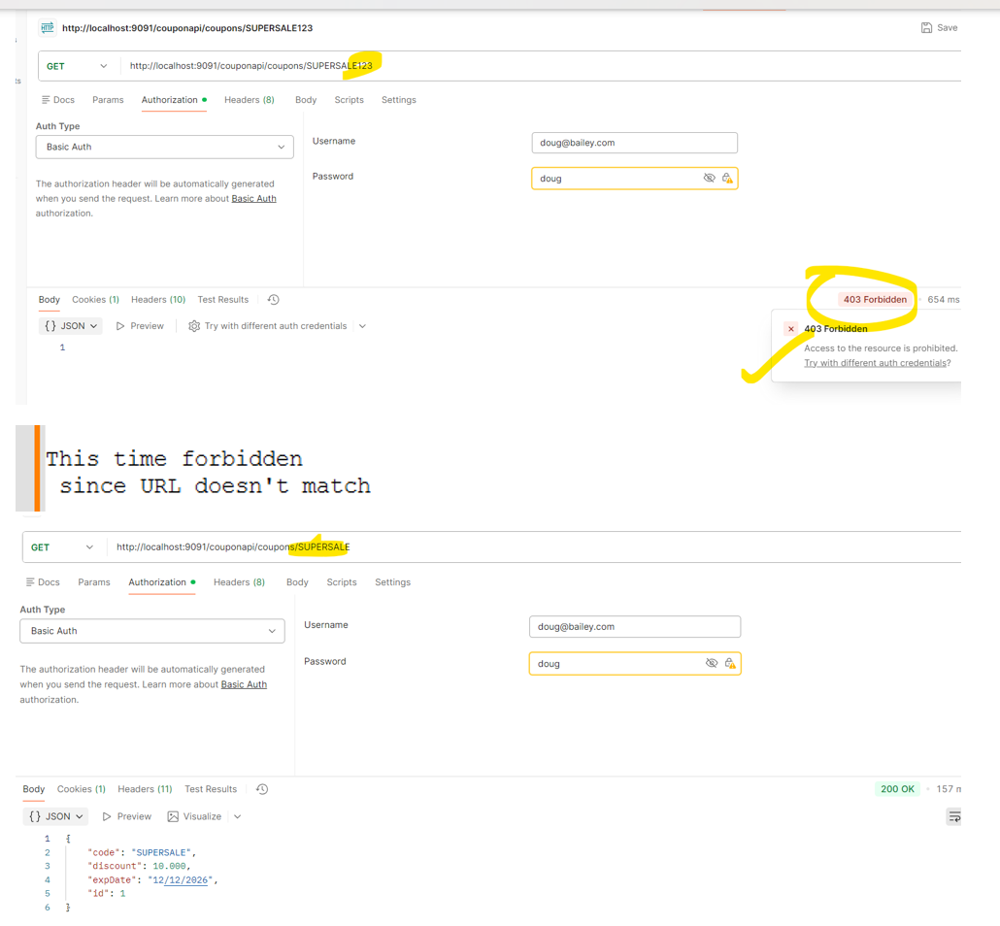
# 50) Quiz
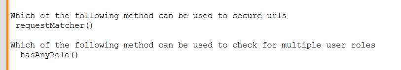
