# Section-4: Create Microservices
# 27.  Use Case
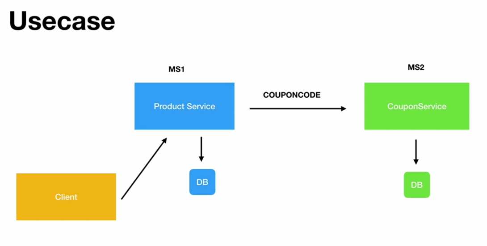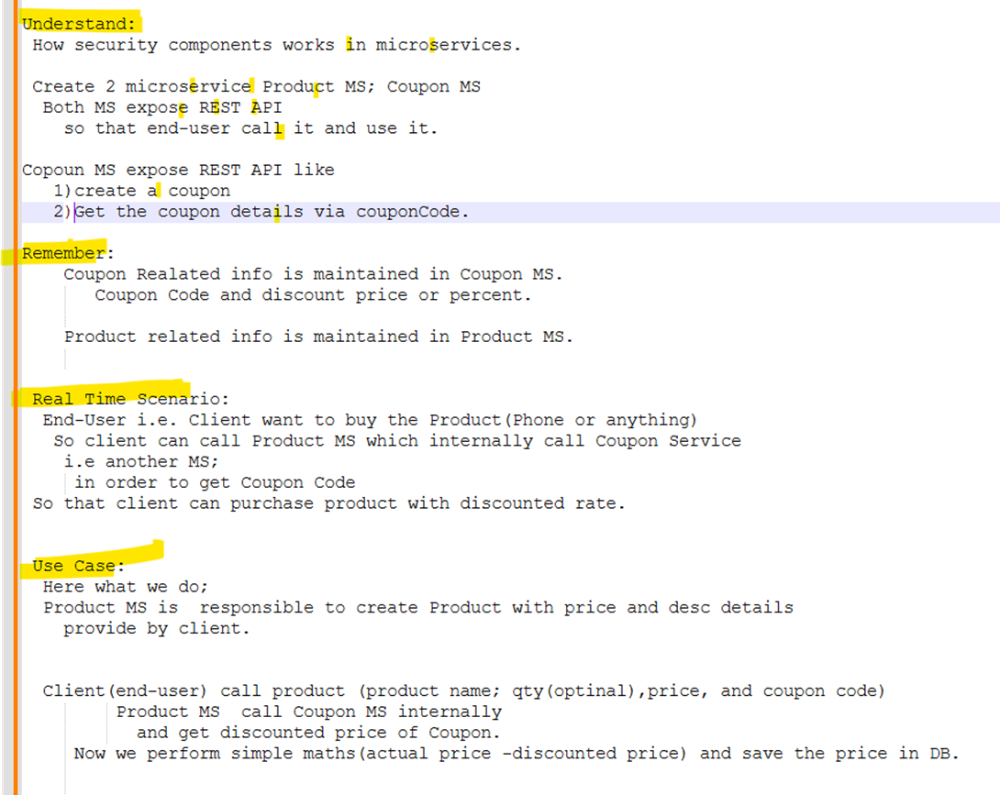
# # 28) Create the databases tables
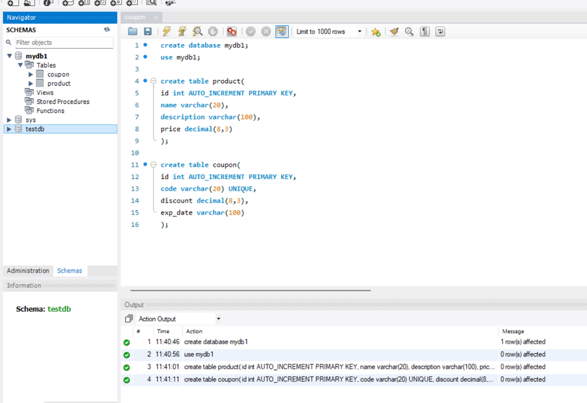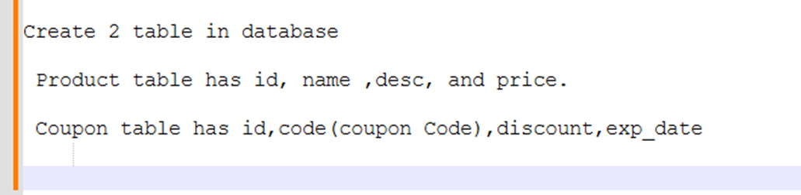
# # 29) Steps in Creating the project
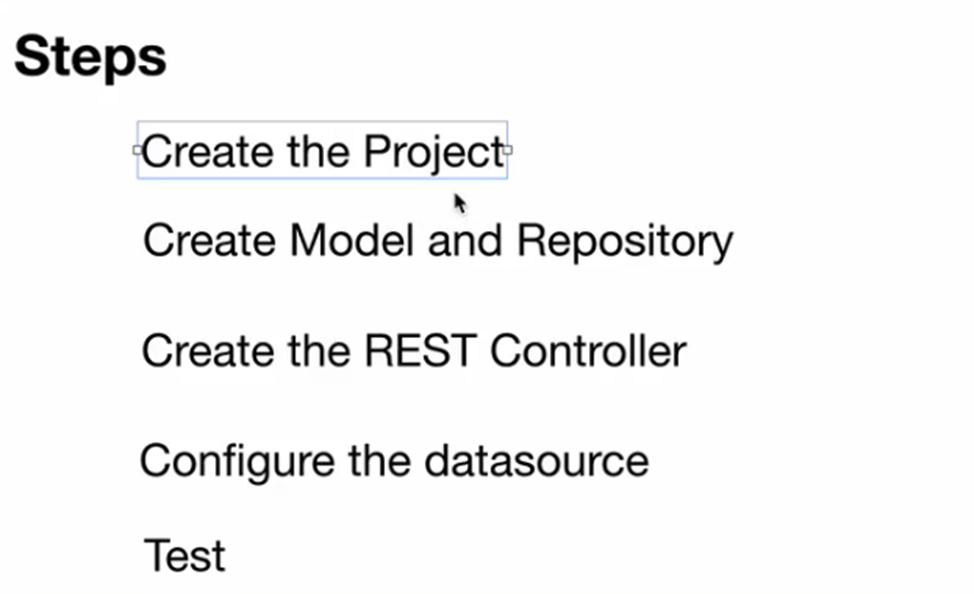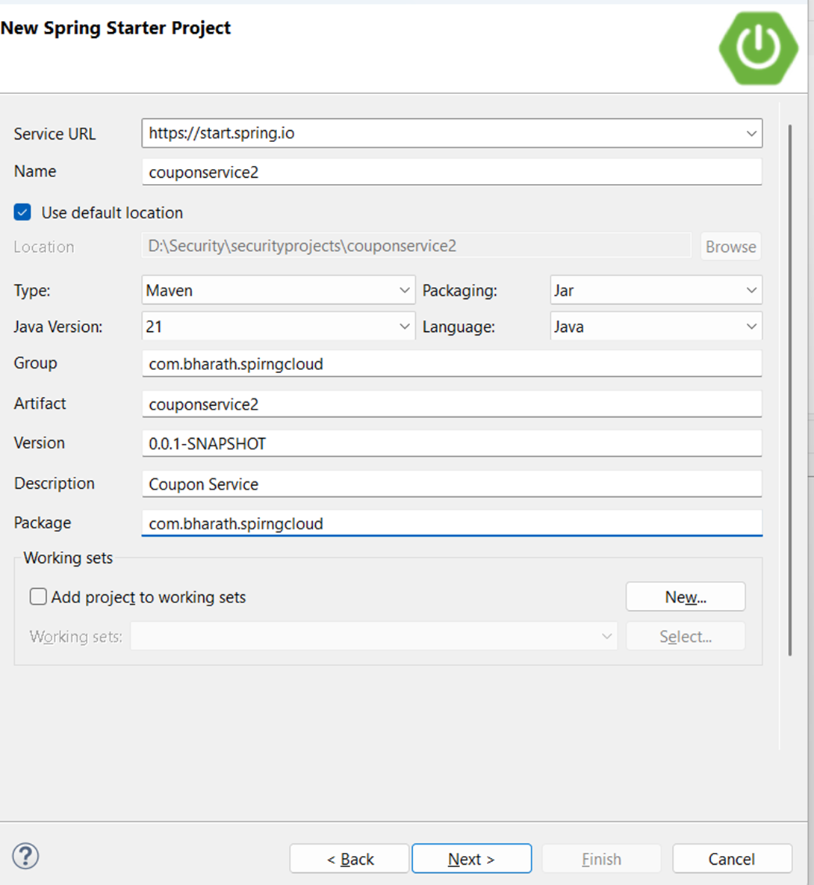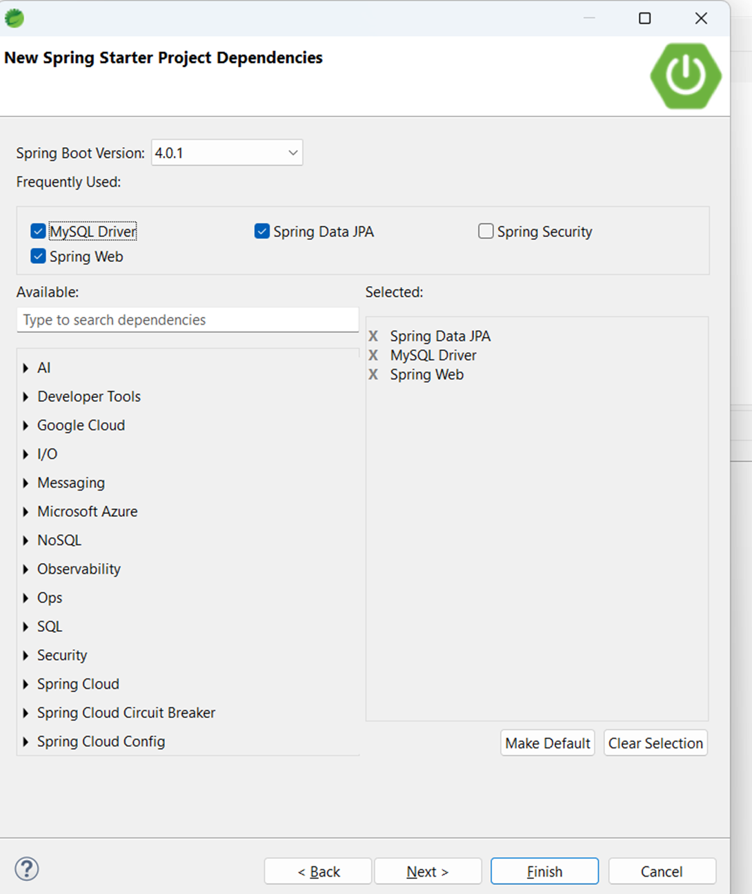
# 30) Create Model and Repository
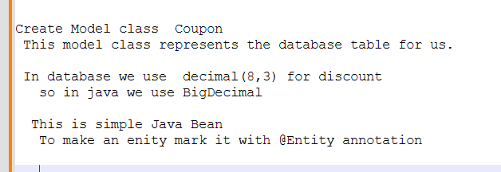
### Table
```sql
use mydb;

create table product(
id int AUTO_INCREMENT PRIMARY KEY,
name varchar(20),
description varchar(100),
price decimal(8,3) 
);

create table coupon(
id int AUTO_INCREMENT PRIMARY KEY,
code varchar(20) UNIQUE,
discount decimal(8,3),
exp_date varchar(100) 
);
```
###  Model class
```java
package com.bharath.spirngcloud.model;

import java.math.BigDecimal;

import jakarta.persistence.Entity;
import jakarta.persistence.GeneratedValue;
import jakarta.persistence.GenerationType;
import jakarta.persistence.Id;

@Entity
public class Coupon {

	@Id
	@GeneratedValue(strategy = GenerationType.IDENTITY) //Automatically incremented
	private Long id;
	private String code;
	private BigDecimal discount;
	private String expDate;

	public Long getId() {
		return id;
	}

	public void setId(Long id) {
		this.id = id;
	}

	public String getCode() {
		return code;
	}

	public void setCode(String code) {
		this.code = code;
	}

	public BigDecimal getDiscount() {
		return discount;
	}

	public void setDiscount(BigDecimal discount) {
		this.discount = discount;
	}

	public String getExpDate() {
		return expDate;
	}

	public void setExpDate(String expDate) {
		this.expDate = expDate;
	}
}
```
### Repository
```java
package com.bharath.spirngcloud.repos;

import org.springframework.data.jpa.repository.JpaRepository;

import com.bharath.spirngcloud.model.Coupon;

//This repository is for Coupon having Long as identity type
public interface CouponRepo extends JpaRepository<Coupon, Long> {

}
```
# 31) Create the REST Controller
### Create the REST Controller and expose out the REST Full API
```java
package com.bharath.spirngcloud.repos;

import org.springframework.data.jpa.repository.JpaRepository;

import com.bharath.spirngcloud.model.Coupon;


public interface CouponRepo extends JpaRepository<Coupon, Long> {

	Coupon findByCode(String code);
	/*So these are the finder by support that spring data JPA has.
	We need not write any SQL simply by writing Java methods like this.
	Internally spring data generates the code for us.*/
}
```
###  CouponRestController
```java
package com.bharath.spirngcloud.controller;

import org.springframework.beans.factory.annotation.Autowired;
import org.springframework.web.bind.annotation.PathVariable;
import org.springframework.web.bind.annotation.RequestBody;
import org.springframework.web.bind.annotation.RequestMapping;
import org.springframework.web.bind.annotation.RequestMethod;
import org.springframework.web.bind.annotation.RestController;

import com.bharath.spirngcloud.model.Coupon;
import com.bharath.spirngcloud.repos.CouponRepo;

@RestController
@RequestMapping("/couponapi") //It map particular URI to API
public class CouponRestController {
	
	@Autowired
	private CouponRepo repo;

	//	 Responsible for Creating Coupon 
	
	@RequestMapping(value = "/coupons", method = RequestMethod.POST)
	public Coupon create(@RequestBody Coupon coupon) {		
		
		return repo.save(coupon);		
	}
	
	//Which variable of path should be used.
	@RequestMapping(value = "/coupons/{code}",method =  RequestMethod.GET)
	public Coupon getCoupon(@PathVariable("code") String code){
		
		return repo.findByCode(code);
	}
}
```
# 32) Configure the Datasource
```properties
spring.application.name=couponservice2

spring.datasource.url=jdbc:mysql://localhost:3306/mydb1
spring.datasource.username=root
spring.datasource.password=root12345
```
# 33) Test
- Run as Spring Boot App
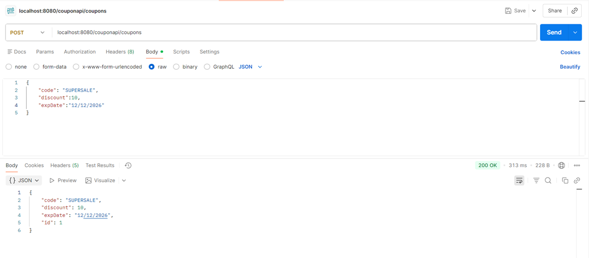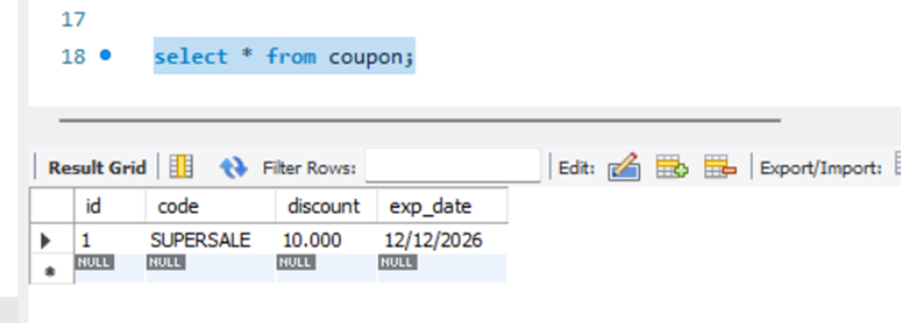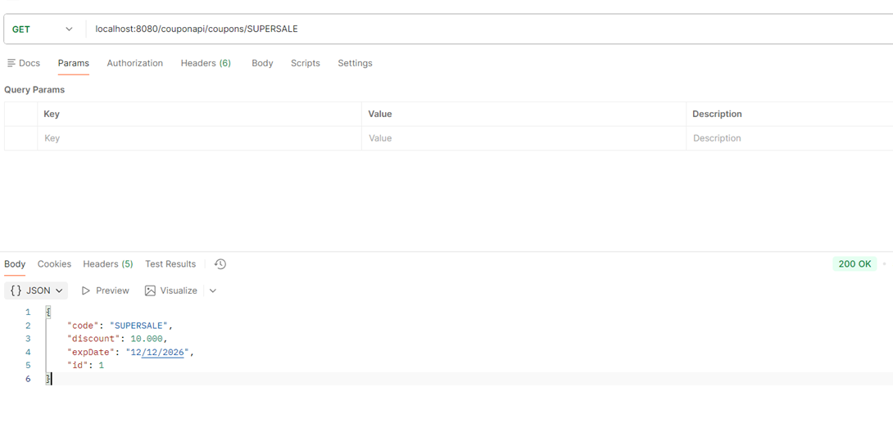
# 34) Create Project Model and Repository for Product MS
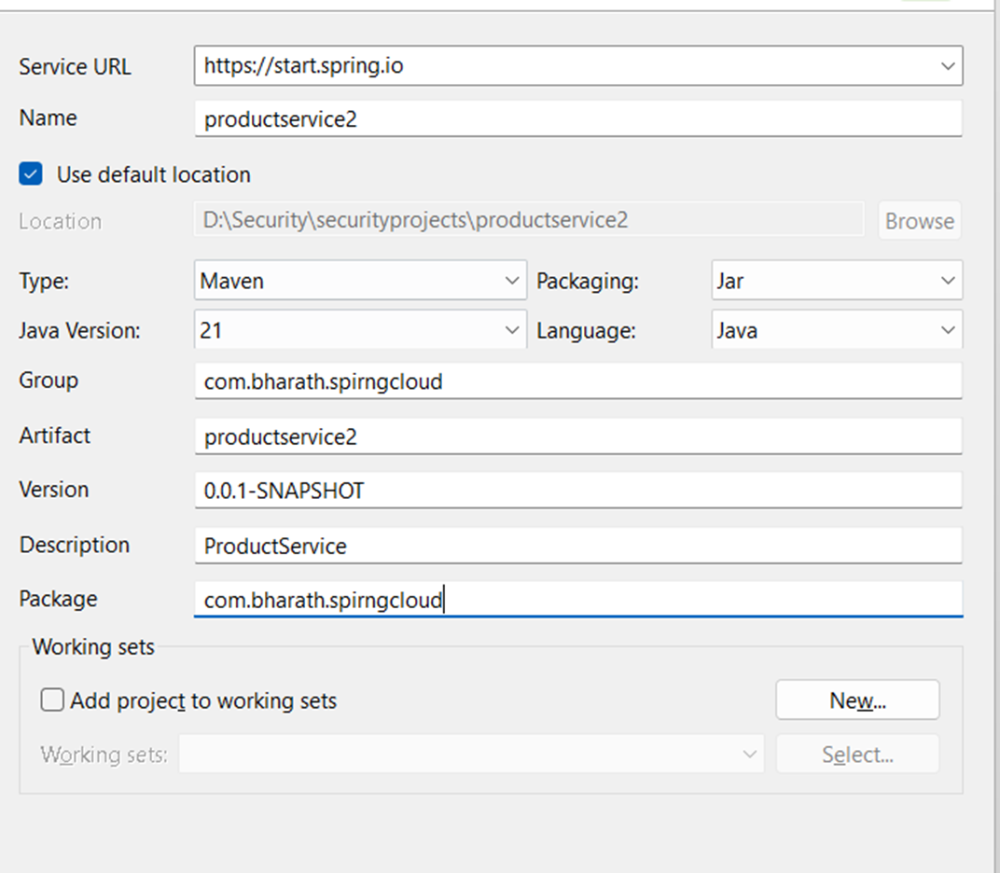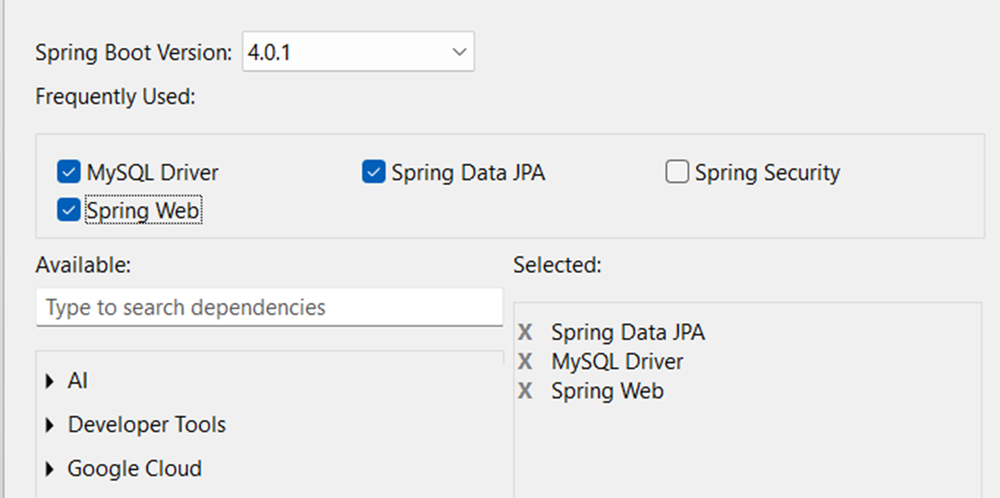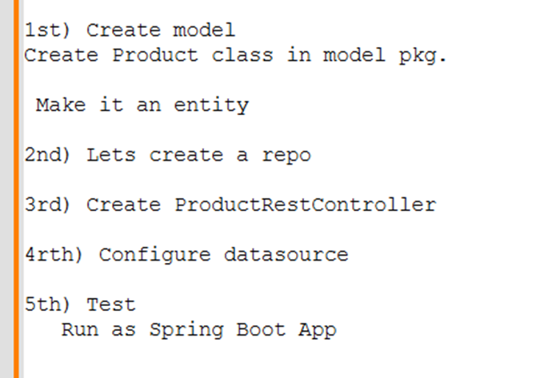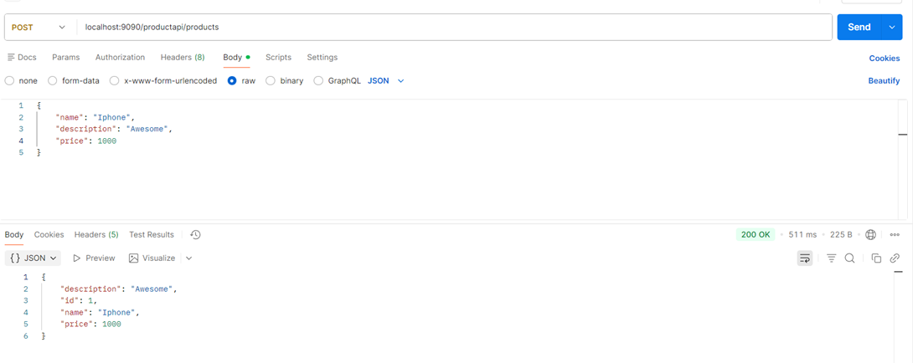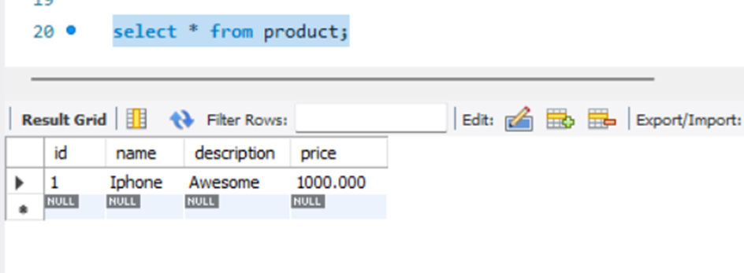
### Model
```java
package com.bharath.spirngcloud.model;

import java.math.BigDecimal;

import jakarta.persistence.Entity;
import jakarta.persistence.GeneratedValue;
import jakarta.persistence.GenerationType;
import jakarta.persistence.Id;

@Entity
public class Product {

	@Id
	@GeneratedValue(strategy = GenerationType.IDENTITY)
	private Long id;
	private String name;
	private String description;
	private BigDecimal price;

	public Long getId() {
		return id;
	}

	public void setId(Long id) {
		this.id = id;
	}

	public String getName() {
		return name;
	}

	public void setName(String name) {
		this.name = name;
	}

	public String getDescription() {
		return description;
	}

	public void setDescription(String description) {
		this.description = description;
	}

	public BigDecimal getPrice() {
		return price;
	}

	public void setPrice(BigDecimal price) {
		this.price = price;
	}

}
```
### Repo
```java
package com.bharath.spirngcloud.repos;

import org.springframework.data.jpa.repository.JpaRepository;

import com.bharath.spirngcloud.model.Product;

public interface ProductRepo extends JpaRepository<Product, Long> {

}
```
### Controller
```java
package com.bharath.spirngcloud.controller;

import org.springframework.beans.factory.annotation.Autowired;
import org.springframework.web.bind.annotation.RequestBody;
import org.springframework.web.bind.annotation.RequestMapping;
import org.springframework.web.bind.annotation.RequestMethod;
import org.springframework.web.bind.annotation.RestController;

import com.bharath.spirngcloud.model.Product;
import com.bharath.spirngcloud.repos.ProductRepo;

@RestController
@RequestMapping("/productapi")
public class ProductRestController {
	
	@Autowired
	ProductRepo repo;
	
	@RequestMapping(value = "/products",method = RequestMethod.POST)
	public Product create(@RequestBody Product product) {
		
		return repo.save(product);
	}

}
```
### Datasource
```java
spring.application.name=productservice2

spring.datasource.url=jdbc:mysql://localhost:3306/mydb1
spring.datasource.username=root
spring.datasource.password=root12345

server.port=9090
```
