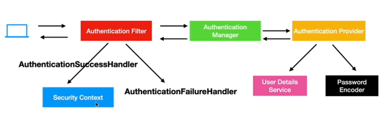

# Section-6 Secure a Web App
## Create a Web app
### Adding a thymeleaf dependency 
```xml
     <dependency>
			<groupId>org.springframework.boot</groupId>
			<artifactId>spring-boot-starter-thymeleaf</artifactId>
	</dependency>
```
### Add pre-defined HTML pages inside template
```properties
Properties - -  Java Build Path - -  Source - - Select Project - - Add folder - -  select Template in resources
```
### index.html
```html
<!DOCTYPE html>
<html xmlns:th="http://www.thymeleaf.org">
<head>
<meta charset="UTF-8">
<title>Coupon Home</title>
</head>
<body>
<a href="/showCreateCoupon">Create Coupon</a><br/>
<a href="/showGetCoupon">Get Coupon</a>
<a href="/logout">Logout</a>

<form name="logoutForm" th:action="@{/logout}" method="post">
        <input type="submit" value="Sign Out" />
    </form>
</body>
</html>
```
### createCoupon.html
```html
<!DOCTYPE html>
<html xmlns:th="http://www.thymeleaf.org">
<head>
<meta charset="UTF-8">
<title>Create Coupon</title>
</head>
<body>
<h2>Create Coupon</h2>
<form action="#" th:action="@{/saveCoupon}" method="post">

Code:<input name="code"/> 
Discount:<input name="discount"/> 
Expiry Date:<input name="expDate"/> 
<input type="submit" value="Save"/> 
</form>

</body>
</html>
```
### couponDetails.html
```html
<!DOCTYPE html>
<head>
<meta charset="UTF-8">
<title>Coupon Details</title>
</head>
<body>
<h2>Coupon Details</h2>
Code:<b th:text="${coupon.code}"></b><br/>
Discount:<b th:text="${coupon.discount}"></b><br/>
Expiry Date:<b th:text="${coupon.expDate}"></b><br/>
</body>
</html>
```
### createResponse.html
```html
<!DOCTYPE html>
<html>
<head>
<meta charset="UTF-8">
<title>Create Response</title>
</head>
<body>
<b>Coupon got created successfully!!</b>
</body>
</html>
```
### getCoupon.html
```html
<!DOCTYPE html>
<html>
<head>
<meta charset="UTF-8">
<title>Get Coupon</title>
</head>
<body>
<form action="/getCoupon" method="post">
Coupon Code<input name="code">
<input type="submit" value="Get Coupon"/>
</form>

</body>
</html>
```
### Create table in database
```sql
create table coupon(
id int AUTO_INCREMENT PRIMARY KEY,
code varchar(20) UNIQUE,
discount decimal(8,3),
exp_date varchar(100) 
);
```
### Model class - Coupon
```java
package com.bharath.spring.cloud.model1;

import java.math.BigDecimal;

import jakarta.persistence.Entity;
import jakarta.persistence.GeneratedValue;
import jakarta.persistence.GenerationType;
import jakarta.persistence.Id;

@Entity
public class Coupon {

	@Id
	@GeneratedValue(strategy = GenerationType.IDENTITY)
	private Long id;
	private String code;
	private BigDecimal discount;
	private String expDate;

	public Long getId() {
		return id;
	}

	public void setId(Long id) {
		this.id = id;
	}

	public String getCode() {
		return code;
	}

	public void setCode(String code) {
		this.code = code;
	}

	public BigDecimal getDiscount() {
		return discount;
	}

	public void setDiscount(BigDecimal discount) {
		this.discount = discount;
	}

	public String getExpDate() {
		return expDate;
	}

	public void setExpDate(String expDate) {
		this.expDate = expDate;
	}

}
```
### Repo class
```java
package com.bharath.spring.cloud.repos;

import org.springframework.data.jpa.repository.JpaRepository;

import com.bharath.spring.cloud.model1.Coupon;

public interface CouponRepo extends JpaRepository<Coupon, Long>{

	Coupon findByCode(String code);
}
```
### property file
```properties
spring.application.name=couponservice1


spring.datasource.url=jdbc:mysql://localhost:3306/mydb1
spring.datasource.username=root
spring.datasource.password=root8956984435

server.port=8092
```
### Controller class
```java
package com.bharath.spring.cloud.controller1;

import org.springframework.beans.factory.annotation.Autowired;
import org.springframework.stereotype.Controller;
import org.springframework.web.bind.annotation.GetMapping;
import org.springframework.web.bind.annotation.PostMapping;
import org.springframework.web.servlet.ModelAndView;

import com.bharath.spring.cloud.model1.Coupon;
import com.bharath.spring.cloud.repos.CouponRepo;

@Controller
public class CouponController {

	@Autowired
	private CouponRepo repo;

	@GetMapping("/")
	public String showindex() {
		return "index";
	}
	
	@GetMapping("/showCreateCoupon")
	public String showCreateCoupon() {
		return "createCoupon";
	}

	@PostMapping("/saveCoupon")
	public String save(Coupon coupon) {
		repo.save(coupon);
		return "createResponse";
	}

	@GetMapping("/showGetCoupon")
	public String showGetCoupon() {
		return "getCoupon";
	}

	@PostMapping("/getCoupon")
	public ModelAndView getCoupon(String code) {
		ModelAndView mav = new ModelAndView("couponDetails");
		System.out.println(code);
		mav.addObject(repo.findByCode(code));
		return mav;
	}
}
```
### Output
- We can see things on o/p
- Successfully create coupon and get the coupon
## Providing Security
### Adding Security Dependency 
```xml
        <dependency>
			<groupId>org.springframework.boot</groupId>
			<artifactId>spring-boot-starter-security</artifactId>
		</dependency>
```
### User and Role table in DB
```sql
use mydb;

CREATE TABLE USER 
(
ID INT NOT NULL AUTO_INCREMENT,
FIRST_NAME VARCHAR(20),
LAST_NAME VARCHAR(20),
EMAIL VARCHAR(20),
PASSWORD VARCHAR(256), 
PRIMARY KEY (ID),
UNIQUE KEY (EMAIL)
);

CREATE TABLE ROLE 
(
ID INT NOT NULL AUTO_INCREMENT,
NAME VARCHAR(20),
PRIMARY KEY (ID)
);

CREATE TABLE USER_ROLE(
USER_ID int,
ROLE_ID int,
FOREIGN KEY (user_id)
REFERENCES user(id),
FOREIGN KEY (role_id)
REFERENCES role(id)
);

insert into user(first_name,last_name,email,password) values ('doug','bailey','doug@bailey.com','$2a$10$U2STWqktwFbvPPsfblVeIuy11vQ1S/0LYLeXQf1ZL0cMXc9HuTEA2');
insert into user(first_name,last_name,email,password) values ('john','ferguson','john@ferguson.com','$2a$10$YzcbPL.fnzbWndjEcRkDmO1E4vOvyVYP5kLsJvtZnR1f8nlXjvq/G');

insert into role values(1,'ROLE_ADMIN');
insert into role values(2,'ROLE_USER');

insert into user_role values(1,1);
insert into user_role values(2,2);

select * from user;
select * from role;
select * from user_role;
```
### Now Java side - User class pojo
```java
package com.bharath.spring.cloud.model1;

import java.util.Set;
import java.util.jar.Attributes.Name;

import jakarta.persistence.Entity;
import jakarta.persistence.FetchType;
import jakarta.persistence.GeneratedValue;
import jakarta.persistence.GenerationType;
import jakarta.persistence.Id;
import jakarta.persistence.JoinColumn;
import jakarta.persistence.JoinTable;
import jakarta.persistence.ManyToMany;

@Entity
public class User {

	@Id
	@GeneratedValue(strategy = GenerationType.IDENTITY)
	private Long id;
	private String firstName;
	private String lastName;
	private String email;
	private String password;
	
	@ManyToMany(fetch = FetchType.EAGER)
	@JoinTable(name = "user_role",joinColumns = @JoinColumn(name="user_id"),inverseJoinColumns = @JoinColumn(name="role_id"))
	private Set<Role> roles;
	
	

	public Set<Role> getRoles() {
		return roles;
	}

	public void setRoles(Set<Role> roles) {
		this.roles = roles;
	}

	public Long getId() {
		return id;
	}

	public void setId(Long id) {
		this.id = id;
	}

	public String getFirstName() {
		return firstName;
	}

	public void setFirstName(String firstName) {
		this.firstName = firstName;
	}

	public String getLastName() {
		return lastName;
	}

	public void setLastName(String lastName) {
		this.lastName = lastName;
	}

	public String getEmail() {
		return email;
	}

	public void setEmail(String email) {
		this.email = email;
	}

	public String getPassword() {
		return password;
	}

	public void setPassword(String password) {
		this.password = password;
	}

}
```
### It's repo
```java
package com.bharath.spring.cloud.repos;

import org.springframework.data.jpa.repository.JpaRepository;

import com.bharath.spring.cloud.model1.User;

public interface UserRepository extends JpaRepository<User, Long> {
	
	//Retrive UserDetails via email
	User findByEmail(String email);

}
```
### Role Class
```java
package com.bharath.spring.cloud.model1;

import java.util.Set;

import org.springframework.security.core.GrantedAuthority;

import jakarta.persistence.Entity;
import jakarta.persistence.GeneratedValue;
import jakarta.persistence.GenerationType;
import jakarta.persistence.Id;
import jakarta.persistence.ManyToMany;

@Entity
public class Role implements GrantedAuthority {

	@Id
	@GeneratedValue(strategy = GenerationType.IDENTITY)
	private Long id;
	private String name;
	
	@ManyToMany(mappedBy = "roles")
	private Set<User> users;
	
	

	public Set<User> getUsers() {
		return users;
	}

	public void setUsers(Set<User> users) {
		this.users = users;
	}

	@Override
	public String getAuthority() {

		return name;
	}

	public Long getId() {
		return id;
	}

	public void setId(Long id) {
		this.id = id;
	}

	public String getName() {
		return name;
	}

	public void setName(String name) {
		this.name = name;
	}

}
```
### It's repo
```java
package com.bharath.spring.cloud.repos;

import org.springframework.data.jpa.repository.JpaRepository;

import com.bharath.spring.cloud.model1.Role;

public interface RoleRepo extends JpaRepository<Role, Long> {

}
```
### UserDetailsService Imp
```java
package com.bharath.spring.cloud.security;

import org.springframework.beans.factory.annotation.Autowired;
import org.springframework.security.core.userdetails.UserDetails;
import org.springframework.security.core.userdetails.UserDetailsService;
import org.springframework.security.core.userdetails.UsernameNotFoundException;
import org.springframework.stereotype.Service;

import com.bharath.spring.cloud.model1.User;
import com.bharath.spring.cloud.repos.UserRepository;

@Service
public class UserDetailsServiceImpl implements UserDetailsService {
	
	@Autowired
	private UserRepository userRepository;

	@Override
	public UserDetails loadUserByUsername(String username) throws UsernameNotFoundException {
		
		User user = userRepository.findByEmail(username);
		
		if(user == null) {
			throw new UsernameNotFoundException("User not found for the email : "+username);
		}
		
		return new org.springframework.security.core.userdetails.User(user.getEmail(),user.getPassword(),user.getRoles());
	}

}
```
### WebSecurityConfig
```java
package com.bharath.spring.cloud.security.config;

import org.springframework.context.annotation.Bean;
import org.springframework.context.annotation.Configuration;
import org.springframework.http.HttpMethod;
import org.springframework.security.config.Customizer;
import org.springframework.security.config.annotation.web.builders.HttpSecurity;
import org.springframework.security.crypto.bcrypt.BCryptPasswordEncoder;
import org.springframework.security.web.SecurityFilterChain;

@Configuration
public class WebSecurityConfig {
	
	// AuthenticationProvider have BcryptPassword Encoder 
	@Bean
	BCryptPasswordEncoder bCryptPasswordEncoder() {
		return new BCryptPasswordEncoder();
	}
	
	@Bean
	SecurityFilterChain filterChain(HttpSecurity httpSecurity) throws Exception {
		
		//form based login
		httpSecurity.formLogin(Customizer.withDefaults());
		
		/*   /showCreateCoupon and /createCoupon are Get-Method 
		 *     but the 1 have Admin access can only able to call it.
		 *   
		 *   Again /saveCoupon is POST method which redirect to /createResponse
		 *     which is nothing but GET method.(Not store in DB)
		 *     
		 *    Anyone with ROLE ADMIN and USER can access /showGetCoupon which display /getCopon
		 *     /getCoupon has POST method which redirect to /getCoupon
		 * */
		httpSecurity.authorizeHttpRequests(auth ->
		auth.requestMatchers(HttpMethod.GET,"/","/showGetCoupon","/getCoupon")
			.hasAnyRole("USER","ADMIN")
		.requestMatchers(HttpMethod.GET,"/showCreateCoupon","/createCoupon","/createResponse")
			.hasRole("ADMIN")
		.requestMatchers(HttpMethod.POST,"/saveCoupon")
		    .hasRole("ADMIN")		
		.requestMatchers(HttpMethod.POST,"/getCoupon")
		    .hasAnyRole("ADMIN","USER")
		);
		
		httpSecurity.csrf(csrf->csrf.disable());
		
		return httpSecurity.build();
	}

}
```
### Check output
#### Desired output we get 
- With Admin access only we able to create coupon
- and with all access we can get the coupon
## Implement Custom login

```
Implement Cusotom login
Create new Interface - SecurityService
Then it's implementation(here actually all comparison apple to apple done)
authentication manager (get userdetails along with Bcrytpt password encoder) 
   then it requrire token to authenticate() 
 token cosist of userdetails, password from db and role 
if authenticate then update Security context.
```
### SecurityService
```java
package com.bharath.spring.cloud.security;

//This interface host the login method;
 
public interface SecurityService {

	// Returns boolean - take 2 parameter
	 //login method take this input
	boolean login(String username,String password);
}
```
### SecurityServiceImpl
```java
package com.bharath.spring.cloud.security;

import org.springframework.beans.factory.annotation.Autowired;
import org.springframework.security.authentication.AuthenticationManager;
import org.springframework.security.authentication.UsernamePasswordAuthenticationToken;
import org.springframework.security.core.context.SecurityContextHolder;
import org.springframework.security.core.userdetails.UserDetails;
import org.springframework.security.core.userdetails.UserDetailsService;
import org.springframework.stereotype.Service;

@Service
public class SecurityServiceImpl implements SecurityService {

	@Autowired
	UserDetailsService userDetailsService; //Runtime Spring inject our implementation
	
	//3re
	@Autowired
	AuthenticationManager authenticationManager; //we requrire bean of it
	
	@Override
	public boolean login(String username, String password) {
		
		//1. retrieve user based on username
		UserDetails userDetails = userDetailsService.loadUserByUsername(username);
		
		//2. We need to create UsernameAndPassword Authentication Token 
		  //So that we can pass to Authentication Manager.
		//AM takes userDetails - fetch from DB
		  // It take password - already encoded
		  // Then take authorities
		UsernamePasswordAuthenticationToken token = new UsernamePasswordAuthenticationToken(userDetails, password,userDetails.getAuthorities());
		
		//3rd We require Authentication Manager - pass it token
		authenticationManager.authenticate(token);
		
		//After authentication this manager will update the flag (authenticated) inside token
		boolean result = token.isAuthenticated();
		
		//if result it true means authentication is successful .... then update SecurityContext 
		if(result) {
			//Get secrityContext then set authentication token on it
			SecurityContextHolder.getContext().setAuthentication(token);
		}
		
		return result;
	}

}
```
### WebSecurityConfig - for Authentication manager bean
```java
package com.bharath.spring.cloud.security.config;

import org.springframework.beans.factory.annotation.Autowired;
import org.springframework.context.annotation.Bean;
import org.springframework.context.annotation.Configuration;
import org.springframework.http.HttpMethod;
import org.springframework.security.authentication.AuthenticationManager;
import org.springframework.security.authentication.ProviderManager;
import org.springframework.security.authentication.dao.DaoAuthenticationProvider;
import org.springframework.security.config.Customizer;
import org.springframework.security.config.annotation.web.builders.HttpSecurity;
import org.springframework.security.core.userdetails.UserDetailsService;
import org.springframework.security.crypto.bcrypt.BCryptPasswordEncoder;
import org.springframework.security.web.SecurityFilterChain;

@Configuration
public class WebSecurityConfig {

	// AuthenticationProvider have BcryptPassword Encoder
	@Bean
	BCryptPasswordEncoder bCryptPasswordEncoder() {
		return new BCryptPasswordEncoder();
	}

	@Autowired
	UserDetailsService userDetailsService;

	@Bean
	AuthenticationManager authManager() {

//		 Depricated Code
		/*
		 * DaoAuthenticationProvider provider = new DaoAuthenticationProvider();
		 * provider.setUserDetailsService(userDetailsService);
		 * provider.setPasswordEncoder(passwordEncoder()); return new
		 * ProviderManager(provider);
		 */

		DaoAuthenticationProvider daoAuthenticationProvider = new DaoAuthenticationProvider(userDetailsService);
		daoAuthenticationProvider.setPasswordEncoder(bCryptPasswordEncoder());

		return new ProviderManager(daoAuthenticationProvider);
	}

	@Bean
	SecurityFilterChain filterChain(HttpSecurity httpSecurity) throws Exception {

		// form based login
		httpSecurity.formLogin(Customizer.withDefaults());

		httpSecurity.authorizeHttpRequests(auth -> auth
				.requestMatchers(HttpMethod.GET, "/", "/showGetCoupon", "/getCoupon").hasAnyRole("USER", "ADMIN")
				.requestMatchers(HttpMethod.GET, "/showCreateCoupon", "/createCoupon", "/createResponse")
				.hasRole("ADMIN").requestMatchers(HttpMethod.POST, "/saveCoupon").hasRole("ADMIN")
				.requestMatchers(HttpMethod.POST, "/getCoupon").hasAnyRole("ADMIN", "USER"));

		httpSecurity.csrf(csrf -> csrf.disable());

		return httpSecurity.build();
	}

}
```
## Create View and Controller
```
Create view and controller 
Download login.html
copy to template folder
To handle that create Controller
```
### login.html
```html
<!DOCTYPE html PUBLIC "-//W3C//DTD HTML 4.01 Transitional//EN" "http://www.w3.org/TR/html4/loose.dtd">
<html xmlns:th="http://www.thymeleaf.org">
<head>
<meta http-equiv="Content-Type" content="text/html; charset=UTF-8">
<title>User Login</title>
</head>
<body>
<h2>Login:</h2>
<form action="#" th:action="@{/login}" method="post">
<pre>
User Name:<input type="text" name="email"/>
Password:<input type="password" name="password"/>
<input type="submit" value="login"/>
 <a href="showReg">Register</a>
 
</pre>
</form>
</body>
</html>
```
### UserController
```java
package com.bharath.spring.cloud.controller1;

import org.springframework.beans.factory.annotation.Autowired;
import org.springframework.stereotype.Controller;
import org.springframework.web.bind.annotation.GetMapping;

import com.bharath.spring.cloud.security.SecurityService;

@Controller
public class UserController {
	
	@Autowired
	private SecurityService securityService;
	

	//Method is responsible for displaying the login page
	  //Starting point of app - Mapp it to absolute url
	@GetMapping("/")
	public String showLoginPage() {
		
		return "login";
	}
	
	//When you go to login page it will ask email pwd and post method login
	 //This name should match with form field
	  //If you use diff name then use @RequestParam annotation
	public String login(String email, String password) {
		
		//Will do authentication with SecurityServie
		boolean loginResponse = securityService.login(email, password);
		
		if(loginResponse) {
			return "index";  //if response is true then redirect to index page
		}
		
		return "login"; //return back to login
	}
}
```
### CouponController
```java
package com.bharath.spring.cloud.controller1;

import org.springframework.beans.factory.annotation.Autowired;
import org.springframework.stereotype.Controller;
import org.springframework.web.bind.annotation.GetMapping;
import org.springframework.web.bind.annotation.PostMapping;
import org.springframework.web.servlet.ModelAndView;

import com.bharath.spring.cloud.model1.Coupon;
import com.bharath.spring.cloud.repos.CouponRepo;

@Controller
public class CouponController {

	@Autowired
	private CouponRepo repo;

//	@GetMapping("/")
//	public String showindex() {
//		return "index";
//	}
	
	@GetMapping("/showCreateCoupon")
	public String showCreateCoupon() {
		return "createCoupon";
	}

	@PostMapping("/saveCoupon")
	public String save(Coupon coupon) {
		repo.save(coupon);
		return "createResponse";
	}

	@GetMapping("/showGetCoupon")
	public String showGetCoupon() {
		return "getCoupon";
	}

	@PostMapping("/getCoupon")
	public ModelAndView getCoupon(String code) {
		ModelAndView mav = new ModelAndView("couponDetails");
		System.out.println(code);
		mav.addObject(repo.findByCode(code));
		return mav;
	}
}
```
### hello

